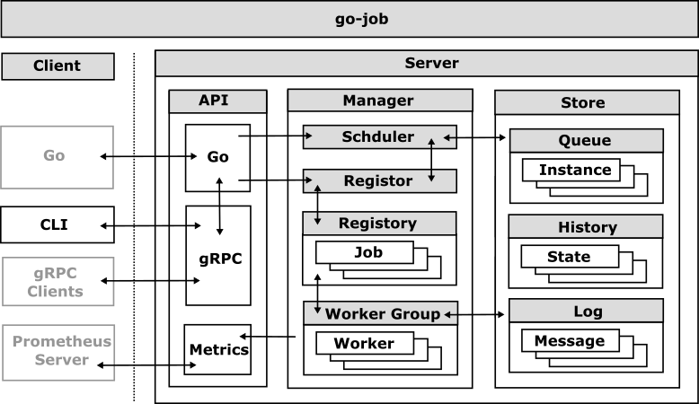

# go-job


[](https://github.com/cybergarage/go-job/actions/workflows/make.yml)
[](https://pkg.go.dev/github.com/cybergarage/go-job)
 [](https://goreportcard.com/report/github.com/cybergarage/go-job) 
[](https://codecov.io/gh/cybergarage/go-job)

`go-job` is a flexible and extensible job scheduling and execution library for Go. It enables you to register, schedule, and manage jobs with arbitrary function signatures, supporting custom executors, priorities, and advanced scheduling options such as cron expressions and delayed execution.



 The library provides robust job observation features, including state and log history tracking, as well as customizable response and error handlers. With support for distributed storage backends, `go-job` is suitable for both local and distributed environments, making it ideal for building scalable, reliable job processing systems in Go applications.

## Features

`go-job` offers a powerful and flexible foundation for job scheduling, execution, and monitoring in Go. It supports arbitrary function execution, dynamic scheduling, prioritization, distributed processing, and detailed job observation.

Key features include:

* **Arbitrary Function Execution** – Register and run any function with custom input/output types using Go's `any` type. This allows you to create jobs from functions with any signature, enabling integration of diverse tasks.
* **Flexible Scheduling** – Schedule jobs to run immediately, after a delay, at a specific time, or on a recurring cron schedule. Supports both one-time and repeated executions (cron), providing versatility for time-based job triggers.
* **Queue Priority & Worker Management** – Prioritize jobs in the queue and dynamically adjust worker pools for concurrency control. Higher-priority jobs run before lower-priority ones, and the number of worker goroutines can be scaled to meet throughput needs.
* **Job Observation** – Monitor the full lifecycle of jobs, including state changes and logs. You can attach custom handlers to job completion or failure events and track each job’s state history and log history for auditing and debugging.
* **Pluggable Storage for Distributed Support** – Abstracted storage via a `Store` interface allows integration of various backends (in-memory, file, database, etc.). This makes it possible to coordinate jobs across multiple nodes, enabling distributed job processing with persistent state.

For detailed feature descriptions and usage examples, see [Feature Overview and Usage Guide](doc/overview.md).

## Getting Started

### Installation

```sh
go get github.com/cybergarage/go-job
```

### Basic Usage

```go
package main

import (
    "fmt"
    "github.com/cybergarage/go-job/job"
)

func main() {
	// Create a job manager
	mgr, _ := job.NewManager()

	// Register a job with a custom executor
	sumJob, _ := job.NewJob(
		job.WithKind("sum"),
		job.WithExecutor(func(a, b int) int { return a + b }),
		job.WithCompleteProcessor(func(ji job.Instance, res []any) {
			ji.Infof("Result: %v", res)
		}),
		job.WithTerminateProcessor(func(ji job.Instance, err error) error {
			ji.Errorf("Error executing job: %v", err)
			return err
		}),
	)
	mgr.RegisterJob(sumJob)

	// Schedule the registered job
	ji, _ := mgr.ScheduleRegisteredJob("sum",
		job.WithArguments(1, 2),
		job.WithScheduleAt(time.Now()), // immediate scheduling is the default, so this option is redundant
	)

	// Start the job manager
	mgr.Start()

	// Wait for the job to complete
	mgr.StopWithWait()

	// Retrieve all queued and executed job instances
	query := job.NewQuery() // queries all job instances (any state)
	jis, _ := mgr.LookupInstances(query)
	for _, ji := range jis {
		fmt.Printf("Job Instance: %s, UUID: %s, State: %s\n", ji.Kind(), ji.UUID(), ji.State())
	}

	// Retrieve and print the job instance state history
	history, _ := mgr.LookupInstanceHistory(ji)
	for _, record := range history {
		fmt.Println(record.State())
	}

	// Retrieve and print the job instance logs
	logs, _ := mgr.LookupInstanceLogs(ji)
	for _, log := range logs {
		fmt.Println(log.Message())
	}
}
```

# User Guides

- Get Started
  - [Quick Start](doc/quick-start.md)
  - [Feature Overview and Usage Guide](doc/overview.md)
  - [go-job Comparison (OpenAI Research)](doc/design-comparison.md)

- References
  - [](https://pkg.go.dev/github.com/cybergarage/go-job)
- Operation
  - [gRPC API](doc/grpc-api.md)
  - [CLI (jobctl)](doc/cmd/cli/jobctl.md)

# Developer Guides

- Development
  - [Design and Architecture](doc/design.md)
- Extending `go-job`
  - [Extension Guide ](doc/extension-guide.md)

# Related Projects

`go-job` is developed in collaboration with the following Cybergarage projects:

- [go-logger](https://github.com/cybergarage/go-logger) 

- [go-safecast](https://github.com/cybergarage/go-safecast) 