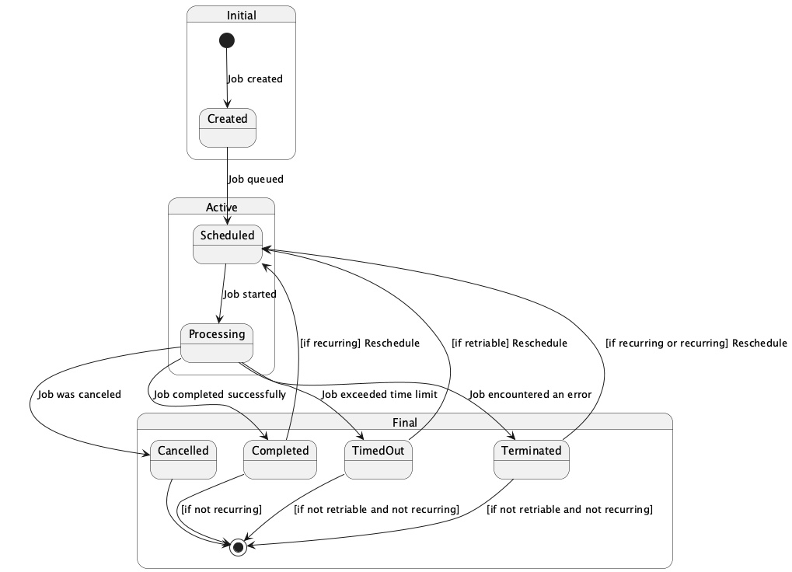

= Design and Architecture 

This document provides a detailed overview of `go-job`'s features and architecture.

:toc:

== Terminology

This section defines the key terms and concepts used throughout the `go-job` system. Understanding these terms is essential for working effectively with the job scheduling and execution framework.

[cols="1,3", options="header"]
|===
|Term |Definition

|Job
|A reusable definition that specifies work to be performed, including the executor function, scheduling rules, and retry policies.

|Job Instance
|A specific execution of a job with concrete arguments, unique identifier, and state tracking throughout its lifecycle.

|Executor
|A Go function that implements the actual business logic for a specific job type.

| Processor
|A function that processes job instances, including completion and termination logic.

|===

== Key Components

`go-job` is designed to handle job scheduling and execution efficiently. The architecture consists of several key components that work together to provide a robust job processing system.

The main components of `go-job` are:

image::img/framework.png[]

[cols="1,3", options="header"]
|===
|Component |Description

|Server
|Provides gRPC endpoints for job scheduling and management, allowing clients to interact with the job system through the manager.

|Manager
|Coordinates job scheduling and execution across go-job components.

|Registry  
|Holds job definitions and their associated executors.

|Worker
|Processes job instances by executing the registered functions.

|Queue
|Manages job instances, ensuring they are processed in the correct order.

|History
|Tracks state transitions of job instances, providing an execution history.

|Log
|Captures logs for each job instance, providing detailed execution information.

|Store
|Provides abstracted persistence for job metadata and execution state, enabling distributed operation and fault tolerance.
|===

=== Selecting Manager or Server Usage

To use `go-job`, you can embed the manager directly to schedule jobs, manage job instances, and process their states and logs. The server component provides a gRPC interface for remote job management, enabling clients to schedule jobs and retrieve job states and logs over the network.

=== Extending with Distributed Store Plugins

The queue, history, and log components can be shared between go-job servers using the store interface, which allows for a distributed architecture where multiple go-job servers can operate together, sharing job queue and instance information. The shared store can be implemented using various distributed storage systems like etcd or FoundationDB, enabling features such as distributed scheduling and cross-node job coordination.

To learn more about the shared store interface and how to extend `go-job` with custom plugins, see the [Extension Guide](doc/extension-guide.md).

== Sequence Diagram ==

The `go-job` server is designed to be modular and extensible. Each component, including the registry, manager, and worker, can be independently developed and maintained. 

The following sequence diagram illustrates the flow of job registration, scheduling, and processing.

image::img/job-seqdgm.png[]

The queue, history, and log components can be shared between go-job servers using distributed store plugins. This enables a distributed architecture where multiple go-job servers can operate together, sharing job instances and state information. To learn more about the store plugins, see the [Extension Guide](doc/extension-guide.md).

Currently, the registry that holds job definitions cannot be shared between go-job servers. Because Go does not support serializing or transmitting function pointers (executors) over RPC, each go-job server must maintain its own local registry of job definitions.

== Job State Lifecycle

The job state in `go-job` is managed through a combination of job instances and their associated states. The state of a job instance is crucial for understanding its lifecycle and for debugging purposes.

[cols="1,3", options="header"]
|===
|State       |Description

|Created
|The job instance has been created and is awaiting scheduling.

|Scheduled
|The job instance has been queued and is waiting to be processed by a worker.

|Processing
|The job instance is currently being executed by a worker.

|Terminated
|The job instance encountered an error or was forcibly stopped before completion.

|Completed
|The job instance finished successfully.

|===

Each job instance can transition through various states, such as `Scheduled`, `Processing`, `Completed`, and `Terminated`. These states are tracked in the job manager, allowing you to monitor the progress and outcome of each job instance.