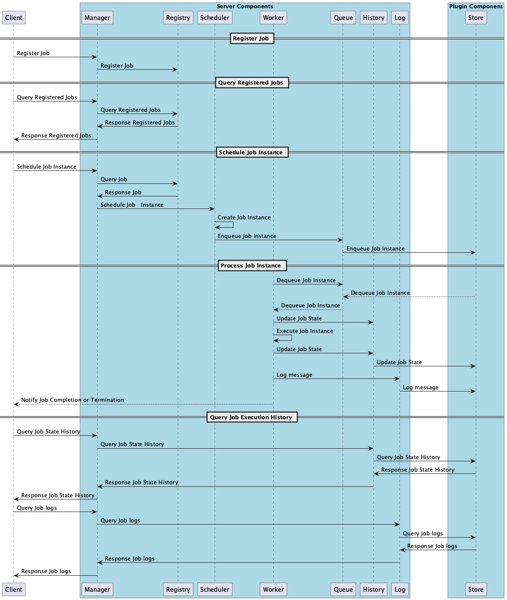
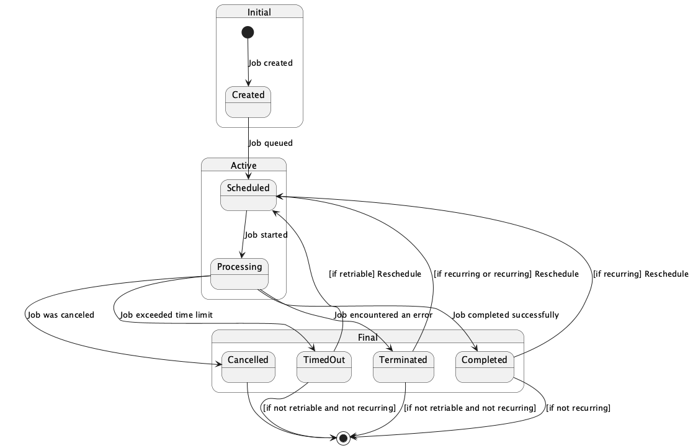

= Design and Architecture 

:toc:

`go-job` is designed to handle job scheduling and execution efficiently, the architecture consists of several key components: the registry which holds job definitions, the manager which coordinates job scheduling, and the worker which processes job instances. The queue is used to manage job instances, ensuring that jobs are executed in the order they are scheduled.

== Key Components

The main components of `go-job` are:
* **Registry**: Holds job definitions and their associated executors.
* **Manager**: Coordinates job scheduling and execution.
* **Worker**: Processes job instances, executing the registered functions.
* **Queue**: Manages job instances, ensuring they are processed in the correct order.   
* **Store**: Provides persistence for job metadata and execution state, allowing for distributed operation and fault tolerance.
* **History**: Tracks the state transitions of job instances, providing a history of execution.
* **Log**: Captures logs for each job instance, providing detailed execution information.

== Sequence Diagram ==

The `go-job` server is designed to be modular and extensible. Each component, including the registry, manager, and worker, can be independently developed and maintained

 The following sequence diagram illustrates the flow of job registration, scheduling, and processing.

The queue, history, and log components can be shared between go-job servers using distributed store plugins. This allows for a distributed architecture where multiple go-job servers can operate together, sharing job instances and state information.

However, the registry which holds job definitions is not shared between go-job servers. Because Go has no built-in RPC mechanism to share job executors (which are function pointers), each go-job server must maintain its own registry of job definitions.

== Job State

The job state in `go-job` is managed through a combination of job instances and their associated states. The state of a job instance is crucial for understanding its lifecycle and for debugging purposes.

Each job instance can transition through various states, such as `Pending`, `Running`, `Completed`, and `Failed`. These states are tracked in the job manager, allowing you to monitor the progress and outcome of each job instance.