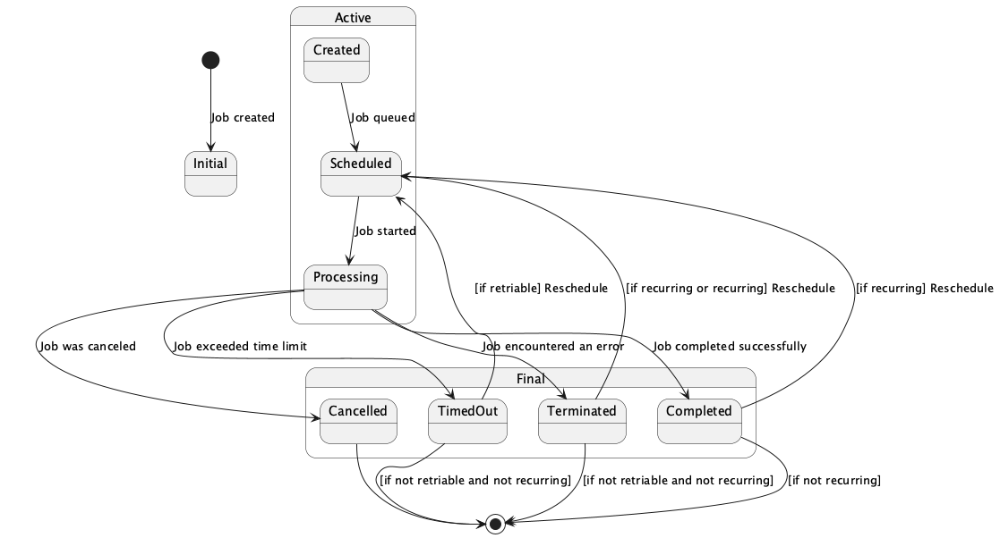

:toc: macro
:toclevels: 1
:toc-title: Table of Contents:
:source-highlighter: coderay
= Design and Architecture 

This document provides a detailed overview of `go-job`'s design and architecture, including future plans.

toc::[]

== Design Concept

These design choices position `go-job` as a scalable, flexible, and production-grade job management framework for Go applications that require robust orchestration of asynchronous or scheduled tasks.

The core design principles of `go-job` are:

* *General-Purpose Job Definition*: `go-job` allows registration of arbitrary Go functions with any signature using `any`-typed arguments and return values.
* *Flexible Scheduling*: `go-job` supports not only cron-style and fixed-interval execution, but also delayed, timed, and immediate scheduling — all within a unified API.
* *Distributed and Observable by Design*: `go-job` introduces a pluggable `Store` interface to enable consistent state sharing and coordination between nodes, while also providing first-class support for logging, state transitions, and job lifecycle monitoring.
* *Extensibility First*: Every component — executors, stores, workers, handlers — is designed to be pluggable or replaceable, making `go-job` suitable for embedded use, microservices, and server-mode deployment with gRPC APIs.
    
For a comparison of design concepts with other OSS job frameworks, see link:https://github.com/cybergarage/go-job/blob/main/doc/design-comparison.md[go-job Comparison (OpenAI Research)].

== Terminology

This section defines the key terms and concepts used throughout the `go-job` system. Understanding these terms is essential for working effectively with the job scheduling and execution framework.

[format="csv", options="header"]
|===
include::inc/term.csv[]
|===

== Key Components

`go-job` is designed to handle job scheduling and execution efficiently. The architecture consists of several key components that work together to provide a robust job processing system.

The main components of `go-job` are:

image::img/job-framework.png[]

[format="csv", options="header"]
|===
include::inc/component.csv[]
|===

== Deployment Options

go-job can be used in two main ways: by embedding the manager directly in your Go application, or by running the standalone server component.
This section explains the differences between these deployment options and helps you choose the best approach for your use case.

[format="csv", options="header"]
|===
include::inc/server.csv[]
|===

=== Selecting Manager Usage

To use go-job, you can embed the manager directly in your Go application to schedule jobs, manage job instances, and process their states and logs. This approach allows you to handle all job management tasks easily within your application.

For more information about embedding the manager in your Go application, see the link:quick-start.md[Quick Start] and link:https://pkg.go.dev/github.com/cybergarage/go-job[Go Reference] documentation.

=== Selecting Server Usage

Alternatively, you can use the go-job server component, which provides a gRPC interface for remote job management. This enables clients to schedule jobs and retrieve job states and logs over the network.

In addition to the gRPC API, the server also exposes a Prometheus-compatible metrics endpoint. This allows you to monitor job execution, server health, and other key metrics using standard Prometheus tools.

For more information about the server component, see the link:grpc-api.md[gRPC API] and link:cmd/cli/jobctl.md[CLI (jobctl)] documentation.

== Job State Lifecycle

The job state in `go-job` is managed through a combination of job instances and their associated states. The state of a job instance is crucial for understanding its lifecycle and for debugging purposes.

[format="csv", options="header"]
|===
include::inc/job-state.csv[]
|===

Each job instance can transition through various states, such as `Scheduled`, `Processing`, `Completed`, `Terminated`, `Canceled`, and `TimedOut`. These states are tracked in the job manager, allowing you to monitor the progress and outcome of each job instance.

== Job Registration and Processing Flow

The `go-job` server is designed to be modular and extensible. Each component, including the registry, manager, and worker, can be independently developed and maintained. 

The following sequence diagram illustrates the flow of job registration, scheduling, and processing.

image::img/job-seqdgm.png[]

=== Store Plugins and Registry Sharing Limitations

Currently, the registry that holds job definitions cannot be shared between go-job servers. Because Go does not support serializing or transmitting function pointers (executors) over RPC, each go-job server must maintain its own local registry of job definitions.

image::img/job-store.png[]

> **Note:** In the future, support for sharing the registry across go-job servers may be added through technologies such as shell scripts, Python, and WebAssembly (Wasm), but there are currently no concrete plans for this feature.

The queue, history, and log components can be shared between go-job servers using distributed store plugins. The following table summarizes the main differences between the available store plugins:

[format="csv", options="header"]
|===
include::inc/store-plugins.csv[]
|===

This enables a distributed architecture where multiple go-job servers can operate together, sharing job instances and state information. To learn more about the store plugins, see link:extension-guide.md[Extension Guide].

include::metrics.adoc[leveloffset=+1]
