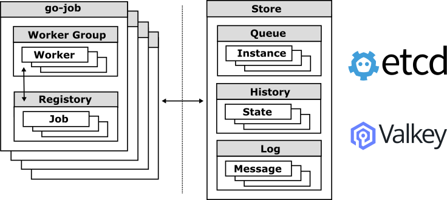

# Design and Architecture

This document provides a detailed overview of \`go-job’s design and architecture, including future plans.

Table of Contents:

- [Design Concept](#_design_concept)
- [Terminology](#_terminology)
- [Key Components](#_key_components)
- [Job State Lifecycle](#_job_state_lifecycle)
- [Job Registration and Processing Flow](#_job_registration_and_processing_flow)

## Design Concept

These design choices position `go-job` as a scalable, flexible, and production-grade job management framework for Go applications that require robust orchestration of asynchronous or scheduled tasks.

The core design principles of `go-job` are:

- **General-Purpose Job Definition**: `go-job` allows registration of arbitrary Go functions with any signature using `any`-typed arguments and return values.

- **Flexible Scheduling**: `go-job` supports not only cron-style and fixed-interval execution, but also delayed, timed, and immediate scheduling — all within a unified API.

- **Distributed and Observable by Design**: `go-job` introduces a pluggable `Store` interface to enable consistent state sharing and coordination between nodes, while also providing first-class support for logging, state transitions, and job lifecycle monitoring.

- **Extensibility First**: Every component — executors, stores, workers, handlers — is designed to be pluggable or replaceable, making `go-job` suitable for embedded use, microservices, and server-mode deployment with gRPC APIs.

For a comparison of design concepts with other OSS job frameworks, see [go-job Comparison (OpenAI Research](https://github.com/cybergarage/go-job/blob/main/doc/design-comparison.md).

## Terminology

This section defines the key terms and concepts used throughout the `go-job` system. Understanding these terms is essential for working effectively with the job scheduling and execution framework.

| Term | Definition |
|----|----|
| Job | A reusable definition that specifies work to be performed, including the executor function, scheduling rules, and retry policies. |
| Job Instance | A specific execution of a job with concrete arguments, unique identifier, and state tracking throughout its lifecycle. |
| Executor | A Go function that implements the actual business logic for a specific job type. |
| Processor | A function that processes job instances, including completion and termination logic. |
| Worker | A component that executes job instances by invoking the registered executors, handling retries, and managing state transitions. |

## Key Components

`go-job` is designed to handle job scheduling and execution efficiently. The architecture consists of several key components that work together to provide a robust job processing system.

The main components of `go-job` are:

| Component | Description |
|----|----|
| Server | Provides gRPC endpoints for job scheduling and management, allowing clients to interact with the job system through the manager. |
| Manager | Coordinates job scheduling and execution across go-job components. |
| Registry | Holds job definitions and their associated executors. |
| Worker | Processes job instances by executing the registered functions. |
| Queue | Manages job instances, ensuring they are processed in the correct order. |
| History | Tracks state transitions of job instances, providing an execution history. |
| Log | Captures logs for each job instance, providing detailed execution information. |
| Store | Provides abstracted persistence for job metadata and execution state, enabling distributed operation and fault tolerance. |

### Selecting Manager Usage

To use go-job, you can embed the manager directly in your Go application to schedule jobs, manage job instances, and process their states and logs. This approach allows you to handle all job management tasks easily within your application.

For more information about embedding the manager in your Go application, see the [Quick Start](quick-start.md) and [Go Reference](https://pkg.go.dev/github.com/cybergarage/go-job) documentation.

### Selecting Server Usage

Alternatively, you can use the go-job server component, which provides a gRPC interface for remote job management. This enables clients to schedule jobs and retrieve job states and logs over the network.

For more information about the server component, see the [gRPC API](grpc-api.md) and [CLI (jobctl)](cmd/cli/jobctl.md) documentation.

## Job State Lifecycle

The job state in `go-job` is managed through a combination of job instances and their associated states. The state of a job instance is crucial for understanding its lifecycle and for debugging purposes.

| State | Description |
|----|----|
| Created | The job instance has been created and is awaiting scheduling. |
| Scheduled | The job instance has been queued and is waiting to be processed by a worker. |
| Processing | The job instance is currently being executed by a worker. |
| Terminated | The job instance encountered an error or was forcibly stopped before completion. |
| Completed | The job instance finished successfully. |

> 

>
> **Note:** The canceled and timed-out states are not explicitly defined in the current implementation. In the future, these states may be added to provide more granular control over job instance lifecycles.
>
> 

Each job instance can transition through various states, such as `Scheduled`, `Processing`, `Completed`, and `Terminated`. These states are tracked in the job manager, allowing you to monitor the progress and outcome of each job instance.

## Job Registration and Processing Flow

The `go-job` server is designed to be modular and extensible. Each component, including the registry, manager, and worker, can be independently developed and maintained.

The following sequence diagram illustrates the flow of job registration, scheduling, and processing.

### Store Plugins and Registry Sharing Limitations

Currently, the registry that holds job definitions cannot be shared between go-job servers. Because Go does not support serializing or transmitting function pointers (executors) over RPC, each go-job server must maintain its own local registry of job definitions.

> 

>
> **Note:** In the future, support for sharing the registry across go-job servers may be added through technologies such as shell scripts, Python, and WebAssembly (Wasm), but there are currently no concrete plans for this feature.
>
> 

The queue, history, and log components can be shared between go-job servers using distributed store plugins. This enables a distributed architecture where multiple go-job servers can operate together, sharing job instances and state information. To learn more about the store plugins, see [Extension Guide](extension-guide.md).

Last updated 2025-08-13 23:17:32 +0900

