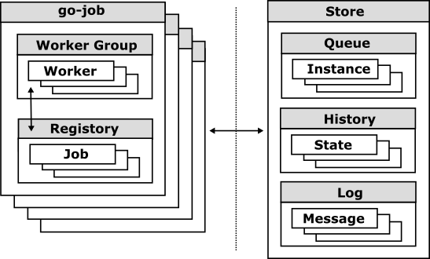

# Extension Guide

This guide provides an overview of how to extend `go-job` with custom plugins, allowing you to add new functionality or integrate with external systems.

## Plugin Development

The `go-job` framework supports custom store plugins that can be used to manage job instances, their states, and logs. A store plugin must implement the `Store` interface, which defines methods for managing job instances and their histories.

<figure>

</figure>

### Store Interface

The Store interface specifies the required methods that every store plugin must implement to manage job instances, their states, and logs:

``` go
// Store defines the interface for job queue, history, and logging.
type Store interface {
    // Name returns the name of the store.
    Name() string
    // PendingStore provides methods for managing job instances.
    QueueStore
    // HistoryStore provides methods for managing job instance state history.
    HistoryStore
    // Start starts the store.
    Start() error
    // Stop stops the store.
    Stop() error
}

// QueueStore is an interface that defines methods for managing job instances in a pending state.
type QueueStore interface {
    // EnqueueInstance stores a job instance in the store.
    EnqueueInstance(ctx context.Context, job Instance) error
    // DequeueNextInstance retrieves and removes the highest priority job instance from the store. If no job instance is available, it returns nil.
    DequeueNextInstance(ctx context.Context) (Instance, error)
    // DequeueInstance removes a job instance from the store by its unique identifier.
    DequeueInstance(ctx context.Context, job Instance) error
    // ListInstances lists all job instances in the store.
    ListInstances(ctx context.Context) ([]Instance, error)
    // ClearInstances clears all job instances in the store.
    ClearInstances(ctx context.Context) error
}

// HistoryStore is an interface that defines methods for managing job instance state history.
type HistoryStore interface {
    // StateStore provides methods for managing job instance state history.
    StateStore
    // LogStore provides methods for logging job instance messages.
    LogStore
}

// StateStore is an interface that defines methods for managing job instance state history.
type StateStore interface {
    // LogInstanceState adds a new state record for a job instance.
    LogInstanceState(ctx context.Context, state InstanceState) error
    // LookupInstanceHistory lists all state records for a job instance that match the specified query. The returned history is sorted by their timestamp.
    LookupInstanceHistory(ctx context.Context, query Query) (InstanceHistory, error)
    // ClearInstanceHistory clears all state records for a job instance that match the specified filter.
    ClearInstanceHistory(ctx context.Context, filter Filter) error
}

// LogStore is an interface that defines methods for logging job instance messages.
type LogStore interface {
    // Infof logs an informational message for a job instance.
    Infof(ctx context.Context, job Instance, format string, args ...any) error
    // Warnf logs a warning message for a job instance.
    Warnf(ctx context.Context, job Instance, format string, args ...any) error
    // Errorf logs an error message for a job instance.
    Errorf(ctx context.Context, job Instance, format string, args ...any) error
    // LookupInstanceLogs lists all log entries for a job instance that match the specified query. The returned logs are sorted by their timestamp.
    LookupInstanceLogs(ctx context.Context, query Query) ([]Log, error)
    // ClearInstanceLogs clears all log entries for a job instance that match the specified filter.
    ClearInstanceLogs(ctx context.Context, filter Filter) error
}
```

### kv.Store Interface

`go-job` provides a key-value store interface for implementing custom store plugins easily.

``` go
// Store represents a key-value store interface.
type Store interface {
    // UniqueKeys returns whether keys should be unique.
    UniqueKeys() bool
    // Name returns the name of the store.
    Name() string
    // Set stores a key-value object. If the key already holds some value, it is overwritten.
    Set(ctx context.Context, obj Object) error
    // Get returns a key-value object of the specified key.
    Get(ctx context.Context, key Key) (Object, error)
    // Scan returns a result set of all key-value objects whose keys have the specified prefix.
    Scan(ctx context.Context, key Key, opts ...Option) (ResultSet, error)
    // Remove removes the specified key-value object.
    Remove(ctx context.Context, obj Object) error
    // Delete deletes all key-value objects whose keys have the specified prefix.
    Delete(ctx context.Context, key Key) error
    // Start starts the store.
    Start() error
    // Stop stops the store.
    Stop() error
}
```
