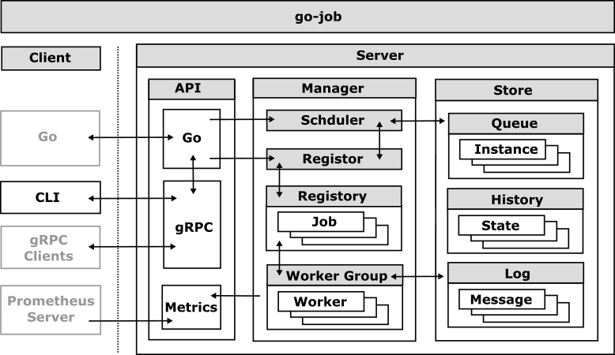

# Prometheus Metrics

`go-job` includes a built-in Prometheus metrics endpoint that exposes a variety of metrics related to the job server’s performance and health.

## Metrics

| Metric Name | Type | Labels | Description |
|----|----|----|----|
| go_job_registered | Gauge |  | Current number of registered jobs |
| go_job_queued | GaugeVec | kind | Current number of queued jobs by kind |
| go_job_executed_total | CounterVec | kind | Total number of executed jobs by kind |
| go_job_completed_total | CounterVec | kind | Total number of successfully completed jobs by kind |
| go_job_terminated_total | CounterVec | kind | Total number of terminated jobs by kind |
| go_job_canceled_total | CounterVec | kind | Total number of canceled jobs by kind |
| go_job_timedout_total | CounterVec | kind | Total number of timed out jobs by kind |
| go_job_duration_seconds | Histogram | kind | Histogram of job execution durations in seconds by kind |
| go_job_workers | Gauge |  | Current number of workers |

Last updated 2025-08-24 13:49:35 +0900

